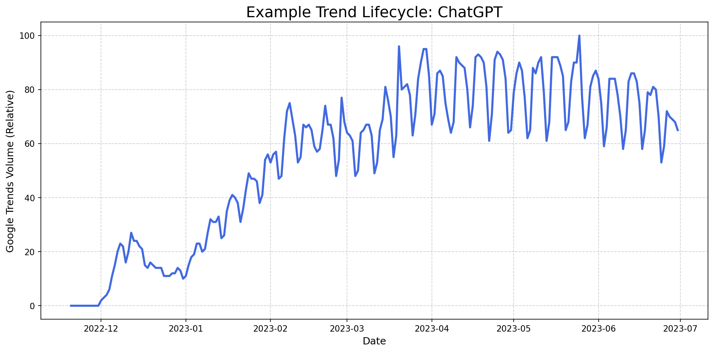

# 🔮 The Virality Predictor: A Trend Lifecycle Forecasting Project


A comprehensive data science project that analyzes the initial "DNA" of a new trend on Google Trends to forecast its popularity over the next 28 days. The project culminates in a fully interactive web application built with Streamlit.

**[➡️ View the Live Streamlit App Here!](https://your-app-url.streamlit.app/)** 
*(Note: Please replace this with your actual Streamlit Cloud URL after deployment. The app may take 30-60 seconds to wake up on the first visit.)*

---

### Table of Contents
1. [Project Goal](#project-goal)
2. [Tech Stack](#tech-stack)
3. [Methodology & Pipeline](#methodology--pipeline)
    - [Data Acquisition](#1-data-acquisition)
    - [Feature Engineering](#2-feature-engineering)
    - [Modeling & Iteration](#3-modeling--iteration)
    - [Web Application](#4-web-application)
4. [Results & Key Findings](#results--key-findings)
5. [Project Structure](#project-structure)
6. [How to Run Locally](#how-to-run-locally)

---

## Project Goal

The primary objective of this project is to build a machine learning model that, given the first 14 days of popularity data for a new trend, can accurately forecast its popularity (as measured by Google Trends score) over the subsequent 28 days.

This tool can provide valuable insights for:
*   **Marketing Teams:** To decide whether to invest in a new trend for a campaign.
*   **Content Creators:** To identify emerging topics with long-term potential.
*   **Product Teams:** To gauge public interest in a new feature or product name.

---

## Tech Stack

This project leverages a modern, industry-standard Python data science stack:

*   **Data Manipulation & Analysis:** Pandas, NumPy
*   **Data Acquisition:** Pytrends (for Google Trends API)
*   **Machine Learning:** Scikit-learn, XGBoost
*   **Web App & Deployment:** Streamlit, Streamlit Community Cloud
*   **Environment Management:** venv, pip

---

## Methodology & Pipeline

The project followed a standard, iterative data science lifecycle from data acquisition to deployment.

### 1. Data Acquisition

*   A list of **~80 distinct historical trends** was curated, covering a wide range of domains including technology, culture, global events, and region-specific topics (India).
*   The `pytrends` library was used to programmatically fetch daily Google Trends data for each keyword over its entire lifecycle.
*   A robust data acquisition script was developed, featuring **geo-targeting** (Worldwide vs. India) and **resilient error handling** (implementing exponential backoff to manage API rate limits).

### 2. Feature Engineering

The core hypothesis is that the *shape* of a trend's initial growth curve contains predictive information about its future. To capture this "shape DNA," a rich set of time-series features was engineered from the first 14 days of data:

*   **Rolling Window Features:** 7-day and 14-day rolling averages and standard deviations to capture local trends and volatility.
*   **Lag Features:** Values from 1, 7, and 14 days prior to capture momentum.
*   **Difference Features:** 7-day difference (`vol_diff_7`) to measure weekly velocity.
*   **Categorical Features:** The trend's geography (Worldwide or India) was one-hot encoded to allow the model to learn region-specific patterns.

### 3. Modeling & Iteration

A **Multi-Output Regressor** with an **XGBoost** base model was chosen for its ability to handle complex, tabular data and predict a sequence of 28 future values simultaneously.

The modeling process was highly iterative, demonstrating a key problem-solving workflow:

*   **Version 1 (Overfitting):** An initial model trained on a small dataset (~12 trends) produced unstable, "hallucinated" predictions. It learned spurious patterns from the limited data.

    *Initial MAE: ~25.0*

*   **Version 2 (Data-Driven Improvement):** The dataset was expanded to over 60 trends. This single change drastically reduced overfitting and improved the model's grasp of general trend behavior.

    *Improved MAE: ~16.2*

*   **Version 3 (Final, Regularized Model):** With a solid data foundation, the focus shifted to fine-tuning. The feature set was simplified to reduce noise, and the XGBoost model was regularized (`max_depth`, `gamma`, `reg_lambda`) to encourage smoother, more generalizable predictions. This resulted in the final, stable model.

    **Final MAE: ~15.5**

### 4. Web Application

The final, trained model was deployed as an interactive web application using Streamlit. The app provides a user-friendly interface to:
*   Input any new keyword and region.
*   Fetch real-time data from Google Trends.
*   Execute the full feature engineering pipeline.
*   Load the pre-trained XGBoost model and generate a 28-day forecast.
*   Display an interactive chart of the known history and predicted future.
*   Provide an automated, data-driven textual summary of the prediction.
*   Include a fallback visual for cases where data cannot be fetched, ensuring a robust user experience.

---

## Results & Key Findings

The final model demonstrates a strong ability to forecast the general shape and magnitude of a trend's lifecycle.


*(This is an example plot of the 'ChatGPT' trend lifecycle, used as a fallback visual in the app.)*

*   **Key Insight:** The most significant factor in model performance was the **size and diversity of the training dataset**. Increasing the number of training examples from 12 to over 60 was more impactful than any single hyperparameter tune.
*   **Model Behavior:** The model successfully learns to distinguish between sharp, short-lived peaks and trends that are likely to plateau or decay slowly.
*   **Practical Application:** The tool provides a valuable directional forecast. While not perfectly predicting daily fluctuations, it effectively answers the key business question: "Will this trend grow, stabilize, or die out in the next month?"

---

## Project Structure

virality-predictor/
 - app/
   - assets/
     - fallback_chatgpt.png # Static image for the app
   - app.py # The Streamlit application script
 - data/ # Stores raw Google Trends data (.csv files)
 - models/
   - virality_predictor_geo_v2_regularized.pkl # The final trained model
 - notebooks/
   - 01_data_acquisition.ipynb # Fetches data from Google Trends
   - 02_feature_engineering.ipynb # (Logic now integrated into training script)
   - 03_model_training.ipynb # Full pipeline: features, training, evaluation
 - .gitignore
 - README.md # You are here!
 - requirements.txt # Project dependencies


---

## How to Run Locally

To set up and run this project on your local machine, follow these steps.

1.  **Clone the Repository:**
    ```bash
    git clone https://github.com/YourUsername/virality-predictor.git
    cd virality-predictor
    ```

2.  **Set Up a Virtual Environment:**
    ```bash
    python -m venv venv
    source venv/bin/activate  # On Windows: venv\Scripts\activate
    ```

3.  **Install Dependencies:**
    ```bash
    pip install -r requirements.txt
    ```

4.  **Run the Streamlit App:**
    ```bash
    streamlit run app/app.py
    ```

Your web browser should automatically open with the application running.
